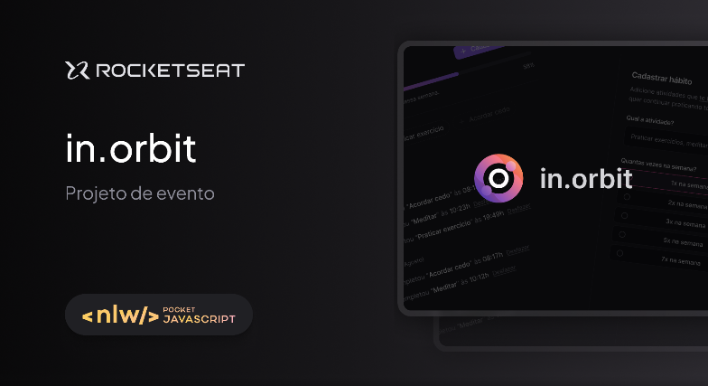
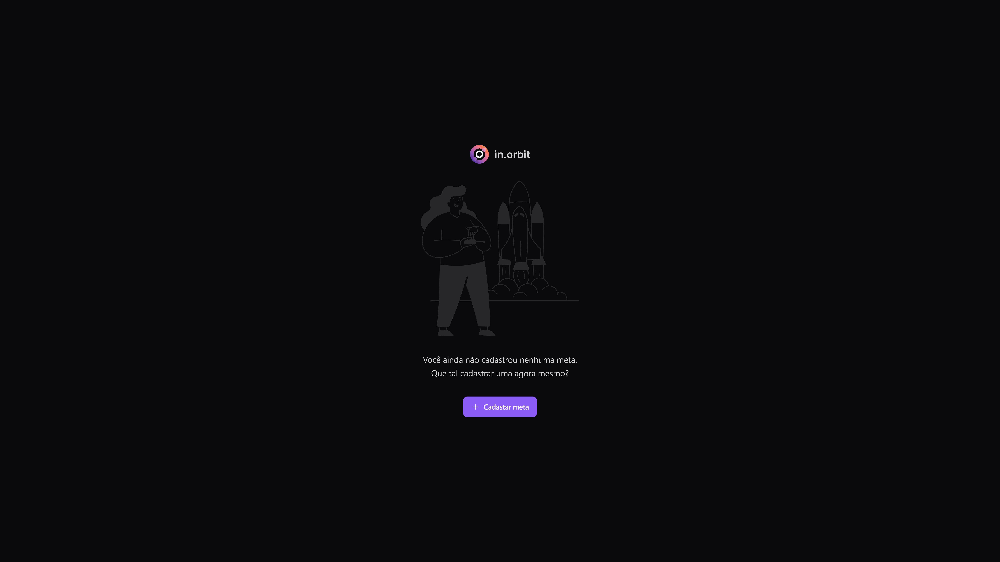
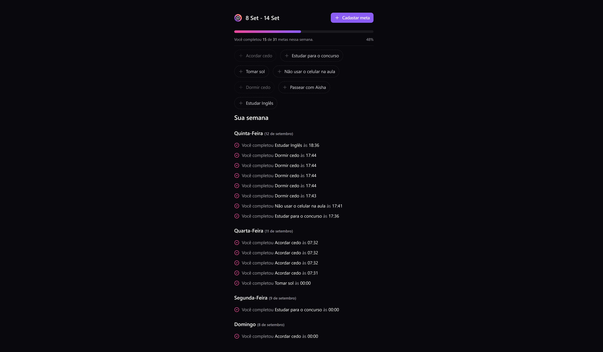

<h1 align="center">
    
</h1>

<h2 align="center">
  🚀 Next Level Week
</h2>

  <a href="#rocket-tecnologias">Tecnologias</a>&nbsp;&nbsp;&nbsp;|&nbsp;&nbsp;&nbsp;
  <a href="#-projeto">Projeto</a>&nbsp;&nbsp;&nbsp;&nbsp;&nbsp;&nbsp;

<h1 align="center">
    
</h1>

<h1 align="center">
    
</h1>

<h1 align="center">
    
</h1>

 

## 👨🏼‍💻 Desenvolvedor 

- [Bruno Batista](https://www.linkedin.com/in/bruno-kaike-84b271138/)

## :rocket: Tecnologias

Esse projeto foi desenvolvido com as seguintes tecnologias:

- [React](https://reactjs.org)
- [Typescript](https://www.typescriptlang.org/)
- [Tailwindcss](https://tailwindcss.com/)
- [Vite](https://vitejs.dev/)

## 💻 Projeto

In Orbit é um projeto que gerencia metas pessoais e apresenta um overview do avanço das metas durante a semana.

## Passos para utilizar
1. Rode `npm i` para instalar as dependências;
2. Rode `docker compose up -d` para iniciar o container do banco de dados postgres;
3. Rode `npm run dev` para iniciar a aplicação;